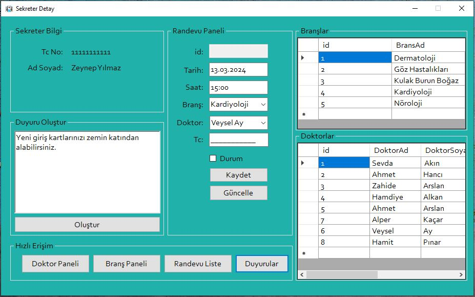

<h1>Hospital Managament System</h1>

It is a desktop application developed in C# that provides hospital management. MSSQL was used as the database. You can adjust database connection settings via sqlconnect.cs.

<h2>Images</h2>
      

      
  
      
 
      
  
      
 
      
  ,
      
  
      
  
      
  
      

